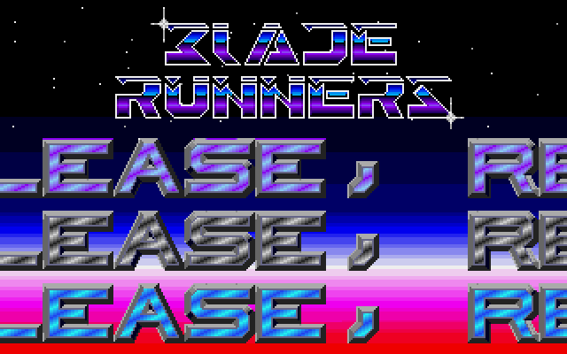
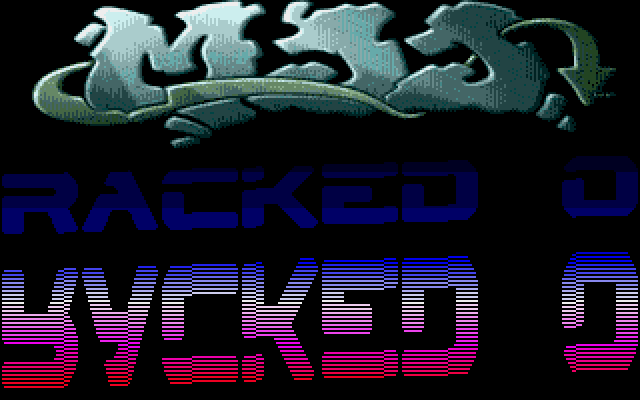

# Stargoose Cracktro — Atari STE Port

A 68000-assembly recreation of RATBOY's 1988 Bladerunners / S.T.C.S. Stargoose cracktro,
ported from Shazz's 2011 HTML5/CODEF JavaScript version (`js_version/main.html`).

Target: **Atari STE, 50 Hz PAL, low-res 320×200×16**. Tools: VASM + Hatari.

## Screenshots

| Channel A — Blade Runners | Channel B — MJJ |
|:---:|:---:|
|  |  |

Press **M** in the demo to flip between the two channels (with a TV-static transition).

## Build & run

```bash
./run.sh                          # assemble + launch in Hatari (STE, auto-runs the PRG)
./build.sh                        # assemble only → build/AUTO/STRGOOSE.PRG
uv run tools/build.py --assets    # regenerate build assets (PNG → planar, SNDH) from assets/
```

`./build.sh` only re-assembles the source; run the `--assets` step after changing
a source asset (PNG/SNDH) or a converter.

**In the demo:** press **M** to flip the TV channel (A↔B), **Esc** to quit.

## Docs

- [`ARCHITECTURE.md`](ARCHITECTURE.md) — layers, data flow, memory budget
- [`decisions.md`](decisions.md) — ADRs for the non-obvious choices
- [`STATUS.md`](STATUS.md) — session-by-session status (read first when picking up)
- [`DEBUG.md`](DEBUG.md) — headless Hatari debugging (fifo + breakpoints)
- [`PERF_REVIEW.md`](PERF_REVIEW.md) · [`PROFILE.md`](PROFILE.md) — the 1-VBL performance work

## Credits

- **Original (1988):** RATBOY / S.T.C.S. — the Bladerunners cracktro used for Stargoose, R-Type, and others
- **HTML5/CODEF port (2011):** Shazz — [wab.com/screen.php?screen=6](https://wab.com/screen.php?screen=6)
- **STE port (2026):** Matt + Anima
